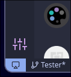
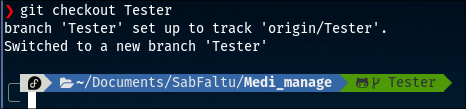
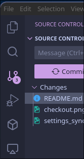
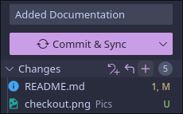
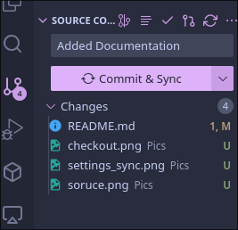
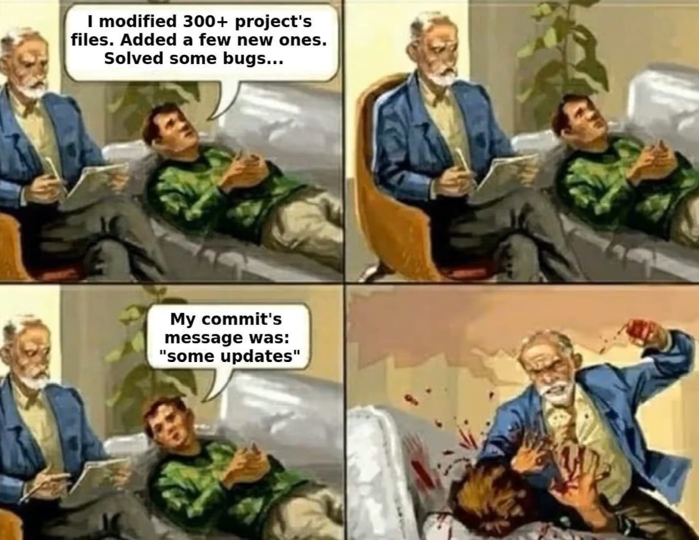

# Welcome Peepals

## Installing Prerequisites

### Chocolatey

- Why Chocolatey?
  Chocolatey is a package manager for windows that is able to install things quicky, like linux (#supremacy)
- Installation

  1. Open Windows poweshell as admin
  2. Run the following command, accepting whats necessay

  ```bash
  Set-ExecutionPolicy Bypass -Scope Process -Force; [System.Net.ServicePointManager]::SecurityProtocol = [System.Net.ServicePointManager]::SecurityProtocol -bor 3072; iex ((New-Object System.Net.WebClient).DownloadString('https://community.chocolatey.org/install.ps1'))
  ```

  Call me if you get an error, its most likely cuz of execution policy.

### Softwares

- Git

  ```bash
  choco install git -y
  ```

- VSCode, cuz its good for new devs. Ignore if you have it

  ```bash
  choco install vscode -y
  ```

  Do setup/link an account to your vscode using github for your own sanity. It will be visible here (cant show complete cuz of wayland reasons):

  

  It may look like a cog wheel

- Additional
  Lookup whatever software you want from the [Chocoliatey store](https://community.chocolatey.org/packages) and install via the terminal, making life easier.

### Work Centric

- Working with Markdown in VSCode

  [Markdown lint](https://marketplace.visualstudio.com/items?itemName=DavidAnson.vscode-markdownlint) - This will scream at you for mistakes made in VSCode using markdown. I **hate it** but its good. Ask someone how to install

  [Accompanying Video](https://youtu.be/watch?v=Hgucu1ch3mo)

- Working with Containers (done for current user/worker)
  
  [Dev Containers](https://marketplace.visualstudio.com/items?itemName=ms-vscode-remote.remote-containers)

## Working with Git and github

- Whats the difference?
  Its the same difference between porn and pornhub.

- Cloning this Repository
  After ensuring you have sucessfully accepted the invite. Clone the repository to a good or desired place using the following command:
  This will make a folder, so be mindful.

  ```bash
  git clone https://github.com/SabFaltu/Medi_manage
  ```

- Changing Branches

  1. Open VSCode to the folder
  2. Open the integrated terminal using `Ctrl+\`` and type the following:

  ```bash
  git checkout Tester
  ```

  3. Ensure you see something similar, and this file is visible through the files panel.
     

- Making Changes

  1. Make changes to this file at the bottom `fun area`, or create new files. Upto you.
  2. Change to the source control panel, and write a message to accompany your push, try to be precise.

     

  3. Stage all changes with the plus

     

  4. Commit and Sync the change

     

     Dont be this guy!

     
     
  5. Alternatively, press `Ctrl+Enter` after putting in a message 🙂

## Fun area

### Facts

- A 70kg black bear once ate 34kgs of cocaine
- A turtle can breathe out of its butt

Good By Dheeraj 

Kahat kabir sansaar me bhanti bhanti ke log kuch thore kuch zada kuch katai madarchod
   
   -Kavi Ashim